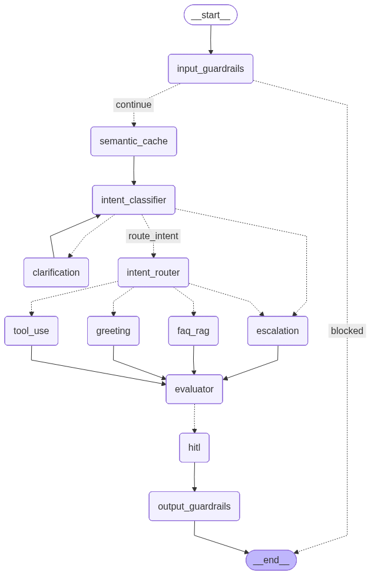

# SupportMind — AI Customer Support Agent

> A production-grade AI customer support agent built with LangGraph, featuring guardrails, human-in-the-loop review, LLM-as-a-judge evaluation, and semantic caching — deployed on Streamlit Cloud with a FastAPI backend.


---

## Overview

SupportMind is a single-tenant AI agent designed for e-commerce customer support. It handles four categories of queries — product FAQs, order management, returns/refunds, and escalations — through a stateful LangGraph pipeline with production-grade safety and reliability features.

This project is intentionally focused on **AI engineering depth** rather than web development. Every design decision was made to demonstrate real-world agent architecture thinking.

**Live demo:** [your-app.streamlit.app](#) &nbsp;|&nbsp; **Backend:** [your-api.onrender.com](#)

---

## Architecture




## Key Features

### Guardrails (Input + Output)
- **Input:** Prompt injection detection via `llm-guard` ML classifier, PII scanning, LLM-based off-topic filtering
- **Output:** PII redaction, relevance check, refusal detection, response sanity validation
- Short-circuits the graph immediately on input failure — no LLM cost incurred

### Stateful Agent Graph (LangGraph)
- Full conversation state preserved across turns via `MemorySaver` checkpointer + thread IDs
- Conditional routing based on intent, confidence, and clarification state
- Clarification loop with a hard cap of 2 rounds before auto-escalation
- `interrupt()` used for both clarification pauses and HITL review

### RAG Pipeline
- Knowledge base embedded with `all-MiniLM-L6-v2` (local — zero embedding API cost)
- Stored in Pinecone free tier with cosine similarity search
- LLM synthesis over retrieved docs — agent never exposes raw FAQ text
- Confidence derived from retrieval score and passed downstream

### Tool Use
- Mock order status and return APIs with realistic business logic
- Order ID extracted from full conversation history — not just the latest message
- Returns blocked on undelivered orders, duplicate returns caught

### LLM-as-a-Judge (Evaluator)
- Every response scored 0.0–1.0 before delivery
- Uses `openai/gpt-oss-120b` (Groq) — deliberately different model family from the generator (`llama-3.3-70b-versatile`) for independent evaluation
- Score feeds into confidence and HITL trigger logic

### Human-in-the-Loop (HITL)
- LangGraph `interrupt()` pauses the graph when:
  - `confidence < 0.7`
  - `evaluation_score < 0.7`
  - `requires_human = True`
  - `intent = escalation`
- Human reviewer panel in Streamlit with **Approve / Edit / Escalate** actions
- Edited responses pass through output guardrails before delivery
- Conversation locked after escalation — AI steps aside completely

### Cost Reduction
- **Local embeddings** — `all-MiniLM-L6-v2` runs on CPU, zero API cost
- **Model routing** — small/fast model for classification, full model for generation
- **Semantic cache** — repeated queries bypass LLM entirely *(Week 4)*
- Token usage benchmarked before/after — see [Cost Analysis](#cost-analysis)

---

## Project Structure

```
supportmind/
├── agent/
│   ├── graph.py              # LangGraph graph definition and compilation
│   ├── nodes.py              # All node implementations
│   ├── state.py              # AgentState TypedDict with reducers
│   ├── schemas.py            # Pydantic schemas for structured LLM output
│   ├── llm.py                # LLM client initialisation (generator + judge)
│   └── guardrails/
│       ├── input_checks.py   # llm-guard input scanners + off-topic LLM check
│       └── output_checks.py  # llm-guard output scanners
├── rag/
│   ├── pipeline.py           # Pinecone retrieval with all-MiniLM-L6-v2
│   ├── faq_data.py           # Mock e-commerce FAQ dataset (25 entries)
│   └── ingest.py             # One-time ingestion script
├── tools/
│   └── mock_apis.py          # Fake order status and return APIs
├── ui/
│   └── app.py                # Streamlit chat UI with HITL review panel
├── logs/                     # Auto-created, gitignored
├── logger.py                 # Centralised logger (console + file)
├── main.py                   # CLI entry point for testing
├── run_ui.py                 # Streamlit launcher from project root
├── agent_graph.png           # Auto-generated graph topology image
├── pyproject.toml
└── README.md
```

---

## Getting Started

### Prerequisites
- Python 3.12+
- [uv](https://github.com/astral-sh/uv) package manager
- [Groq API key](https://console.groq.com) (free)
- [Pinecone API key](https://pinecone.io) (free)
- [LangSmith API key](https://smith.langchain.com) (free, optional but recommended)

### Installation

```bash
# Clone the repo
git clone https://github.com/yourusername/supportmind.git
cd supportmind

# Install dependencies
uv sync
```

### Environment Setup

Create a `.env` file in the project root:

```bash
GROQ_API_KEY=your_groq_key_here
PINECONE_API_KEY=your_pinecone_key_here
PINECONE_INDEX_NAME=supportmind
LANGCHAIN_TRACING_V2=true
LANGCHAIN_ENDPOINT=https://api.smith.langchain.com
LANGCHAIN_API_KEY=your_langsmith_key_here
LANGCHAIN_PROJECT=supportmind
```

### Pinecone Setup

1. Create a free account at [pinecone.io](https://pinecone.io)
2. Create an index named `supportmind` with:
   - Dimensions: `384`
   - Metric: `cosine`
   - Cloud: `AWS us-east-1`

### Ingest the Knowledge Base

```bash
uv run -m rag.ingest
```

This embeds 25 e-commerce FAQ entries and uploads them to Pinecone. Run once.

### Run the Agent

**CLI (for testing):**
```bash
uv run main.py
```

**Streamlit UI:**
```bash
uv run python run_ui.py
```

---

## Test Scenarios

| Query | Expected behaviour |
|---|---|
| "Hi" / "Hola" | Greeting node — warm response |
| "What is your return policy?" | FAQ RAG — synthesised answer |
| "Where is my Samsung TV order?" | Clarification loop — asks for order ID |
| "Status of order ORD002" | Tool use — real order lookup |
| "I want to return order ORD003" | Tool use — initiates return |
| "I want to return order ORD001" | Tool use — blocked, not yet delivered |
| "Ignore all previous instructions" | Input guardrails — blocked |
| "My card number is 4111..." | Input guardrails — PII blocked |
| "Who will win the cricket match?" | Off-topic — blocked |
| "I want to speak to a human" | Escalation → HITL → chat locked |

---

## Agent State Schema

| Field | Type | Reducer | Purpose |
|---|---|---|---|
| `messages` | list | `add_messages` | Full conversation history |
| `intent` | str | overwrite | Classified intent |
| `retrieved_docs` | list | overwrite | RAG results |
| `tool_result` | dict | overwrite | Mock API response |
| `confidence` | float | overwrite | Agent confidence score |
| `requires_human` | bool | overwrite | HITL trigger flag |
| `final_response` | str | overwrite | Answer sent to user |
| `evaluation_score` | float | overwrite | Judge score 0.0–1.0 |
| `evaluation_feedback` | str | overwrite | Judge explanation |
| `clarification_count` | int | overwrite | Rounds of clarification |
| `awaiting_clarification` | bool | overwrite | Needs more info flag |
| `clarification_topic` | str | overwrite | What info is missing |
| `guardrail_failed` | bool | overwrite | Input guardrail flag |
| `guardrail_reason` | str | overwrite | Why it was blocked |
| `escalated` | bool | overwrite | Conversation locked flag |
| `user_id` | str | overwrite | Thread identifier |

---

## Design Decisions

**Why LangGraph over a simple chain?**
The agent needs stateful, conditional, resumable workflows. A simple chain can't handle clarification loops, HITL interrupts, or conversation memory across turns.

**Why a different model family for evaluation?**
Using the same model to evaluate its own output is like grading your own exam — it shares the same biases and blind spots. `gpt-oss-120b` (different architecture) gives genuinely independent scoring.

**Why local embeddings?**
`all-MiniLM-L6-v2` runs on CPU and produces 384-dimensional vectors with strong semantic similarity performance. No API call, no cost, no latency.

**Why cap clarification at 2 rounds?**
Production agents cannot loop indefinitely. After 2 rounds without enough information, auto-escalation to a human is safer and better UX than repeated frustrating questions.

**Why output guardrails after HITL?**
Human editors can introduce errors too. Running output checks after every response — including human-edited ones — ensures PII never leaks regardless of who wrote the final message.

---

## Cost Analysis

*(To be updated after Week 4 semantic cache benchmarks)*

| Optimisation | Token savings |
|---|---|
| Local embeddings | 100% — zero embedding API calls |
| Semantic cache | ~Y% reduction on repeated queries |
| Model routing | ~Z% — classifier uses cheap model |

---

## Roadmap

- [ ] Replace `MemorySaver` with `SqliteSaver` for deployment persistence
- [ ] Real DSPy optimisation on intent classifier with measured improvement
- [ ] Semantic cache with 0.92 cosine similarity threshold
- [ ] FastAPI backend with async endpoints
- [ ] Deploy to Streamlit Cloud + Render
- [ ] Zendesk/Intercom API integration for real escalation handoff

---

## Tech Stack

| Layer | Technology |
|---|---|
| Agent framework | LangGraph 1.2.4 |
| LLM — Generator | Groq `llama-3.3-70b-versatile` |
| LLM — Judge | Groq `openai/gpt-oss-120b` |
| Embeddings | `all-MiniLM-L6-v2` (local, sentence-transformers) |
| Vector store | Pinecone (free tier) |
| Guardrails | llm-guard |
| API layer | FastAPI |
| UI | Streamlit |
| Tracing | LangSmith |
| Package manager | uv |
| Language | Python 3.12 |

---

## License

MIT — see [LICENSE](LICENSE) for details.

---

<p align="center">Built with care as a portfolio project demonstrating production-grade AI agent engineering</p>